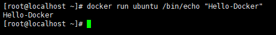
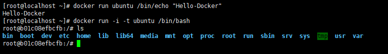
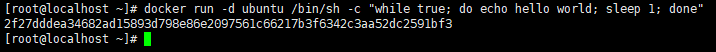
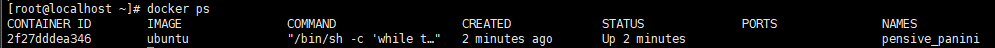
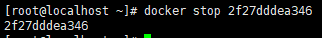
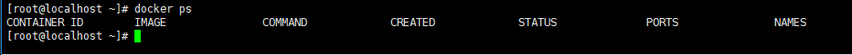

# Docker Hello World

Docker 允许在容器内运行应用程序， 使用 docker run 命令来在容器内运行一个应用程序。

输出Hello world

```bash
docker run ubuntu /bin/echo "Hello-Docker"
````



解析

- docker: Docker的二进制执行文件。
- run: 与前面的 docker 组合来运行一个容器。
- ubuntu: 指定要运行的镜像，Docker首先从本地主机上查找镜像是否存在，如果不存在，Docker 就会从镜像仓库 Docker Hub 下载公共镜像。
- /bin/echo "Hello-Docker": 在启动的容器里执行的命令

以上命令完整的意思可以解释为：Docker 以 ubuntu 镜像创建一个新容器，然后在容器里执行 bin/echo "Hello-Docker"，然后输出结果。

---

## 进行交互式的容器

通过docker的两个参数 -i -t，让docker运行的容器实现"对话"的能力

```bash
docker run -i -t ubuntu /bin/bash
```

此时已进入一个 ubuntu 系统的容器

在容器中运行命令 cat /proc/version和ls分别查看当前系统的版本信息和当前目录下的文件列表



解析

- -t : 在新容器内指定一个伪终端或终端。

- -i : 允许你对容器内的标准输入 (STDIN) 进行交互。

**通过运行exit命令或者使用CTRL+D来退出容器*

---

## 启动容器 (后台模式)

```bash
docker run -d ubuntu /bin/sh -c "while true; do echo hello world; sleep 1; done"
```



在输出中，我们没有看到期望的"hello world"，而是一串长字符

2f27dddea34682ad15893d798e86e2097561c66217b3f6342c3aa52dc2591bf3

这个长字符串叫做容器ID，对每个容器来说都是唯一的，我们可以通过容器ID来查看对应的容器发生了什么。

首先，我们需要确认容器有在运行，可以通过 `docker ps` 来查看


- CONTAINER ID:容器ID

- NAMES:自动分配的容器名称

在容器内使用`docker logs 容器ID`命令或者`docker logs 自动分配的容器名称`，查看容器内的标准输出

---

## 停止容器

使用 `docker stop 容器ID` 命令停止容器,或者`docker stop 自动分配的容器名称`命令


通过 `docker ps` 查看,容器已经停止工作
