# Docker 容器使用

## Docker 客户端

docker 客户端非常简单 ,可以直接输入 `docker` 命令来查看到 Docker 客户端的所有命令选项。
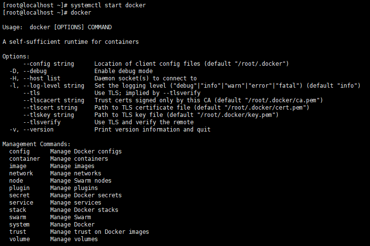

可以通过命令 docker command --help 更深入的了解指定的 Docker 命令使用方法。

例如要查看 docker stats 指令的具体使用方法：

```bash
docker stats --help
```

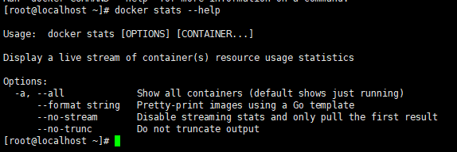

---

## 运行一个 web 应用

前面运行的容器并没有一些什么特别的用处。

接下来让尝试使用 docker 构建一个 web 应用程序。

将在 docker 容器中运行一个 Python Flask 应用来运行一个 web 应用。

```bash
docker pull training/webapp #载入镜像
docker run -d -P training/webapp python app.py
```

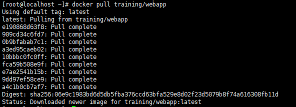
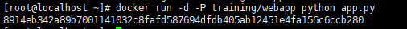

参数说明:

- -d : 让容器在后台运行.
- -P : 将容器内部使用的网络端口映射到主机上.

---

## 查看 WEB 应用容器

使用 `docker ps` 来查看正在运行的容器：
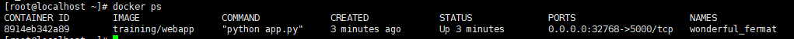

这里多了端口信息:

```shell
PORTS
0.0.0.0:32768->5000/tcp
```

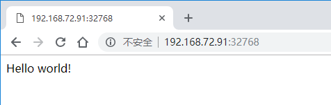

也可以通过 -p 参数来设置不一样的端口

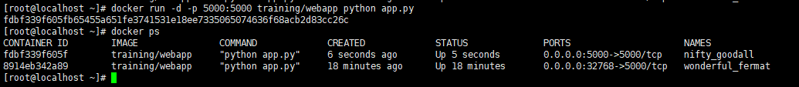

---

## 网络端口的快捷方式

通过 `docker ps` 命令可以查看到容器的端口映射，docker 还提供了另一个快捷方式 `docker port`，使用 `docker port` 可以查看指定 （ID 或者名字）容器的某个确定端口映射到宿主机的端口号。

上面创建的 web 应用容器 ID 为 fdbf339f605f 名字为 nifty_goodall。

可以使用 docker port fdbf339f605f 或 docker port nifty_goodall 来查看容器端口的映射情况。
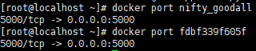

---

## 查看 WEB 应用程序日志

`docker logs` [ID 或者名字] 可以查看容器内部的标准输出.
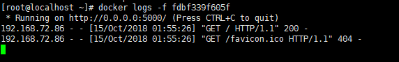

- -f : 让 docker logs 像使用 tail -f 一样来输出容器内部的标准输出.

从上面，可以看到应用程序使用的是 5000 端口,并且能够查看到应用程序的访问日志。

---

## 查看 WEB 应用程序容器的进程

还可以使用 `docker top` [ID 或者名字] 来查看容器内部运行的进程
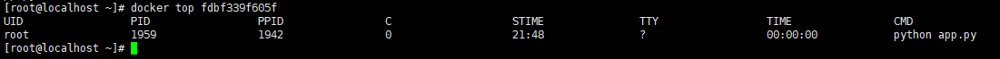

---

## 检查 WEB 应用程序

使用 `docker inspect` 来查看 Docker 的底层信息。它会返回一个 JSON 文件记录着 Docker 容器的配置和状态信息。
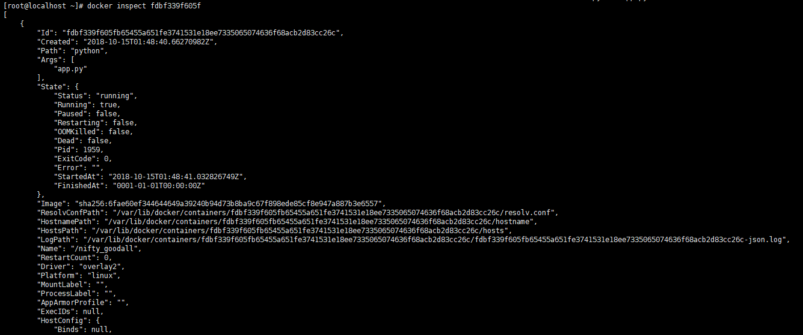

```json
[
  {
    "Id": "fdbf339f605fb65455a651fe3741531e18ee7335065074636f68acb2d83cc26c",
    "Created": "2018-10-15T01:48:40.66270982Z",
    "Path": "python",
    "Args": ["app.py"],
    "State": {
      "Status": "running",
      "Running": true,
      "Paused": false,
      "Restarting": false,
      "OOMKilled": false,
      "Dead": false,
      "Pid": 1959,
      "ExitCode": 0,
      "Error": "",
      "StartedAt": "2018-10-15T01:48:41.032826749Z",
      "FinishedAt": "0001-01-01T00:00:00Z"
    },
    "Image": "sha256:6fae60ef344644649a39240b94d73b8ba9c67f898ede85cf8e947a887b3e6557",
    "ResolvConfPath": "/var/lib/docker/containers/fdbf339f605fb65455a651fe3741531e18ee7335065074636f68acb2d83cc26c/resolv.conf",
    "HostnamePath": "/var/lib/docker/containers/fdbf339f605fb65455a651fe3741531e18ee7335065074636f68acb2d83cc26c/hostname",
    "HostsPath": "/var/lib/docker/containers/fdbf339f605fb65455a651fe3741531e18ee7335065074636f68acb2d83cc26c/hosts",
    "LogPath": "/var/lib/docker/containers/fdbf339f605fb65455a651fe3741531e18ee7335065074636f68acb2d83cc26c/fdbf339f605fb65455a651fe3741531e18ee7335065074636f68acb2d83cc26c-json.log",
    "Name": "/nifty_goodall",
    "RestartCount": 0,
    "Driver": "overlay2",
    "Platform": "linux",
    "MountLabel": "",
    "ProcessLabel": "",
    "AppArmorProfile": "",
    "ExecIDs": null,
    "HostConfig": {
      "Binds": null,
      "ContainerIDFile": "",
      "LogConfig": {
        "Type": "json-file",
        "Config": {}
      },
      "NetworkMode": "default",
      "PortBindings": {
        "5000/tcp": [
          {
            "HostIp": "",
            "HostPort": "5000"
          }
        ]
      },
      "RestartPolicy": {
        "Name": "no",
        "MaximumRetryCount": 0
      },
      "AutoRemove": false,
      "VolumeDriver": "",
      "VolumesFrom": null,
      "CapAdd": null,
      "CapDrop": null,
      "Dns": [],
      "DnsOptions": [],
      "DnsSearch": [],
      "ExtraHosts": null,
      "GroupAdd": null,
      "IpcMode": "shareable",
      "Cgroup": "",
      "Links": null,
      "OomScoreAdj": 0,
      "PidMode": "",
      "Privileged": false,
      "PublishAllPorts": false,
      "ReadonlyRootfs": false,
      "SecurityOpt": null,
      "UTSMode": "",
      "UsernsMode": "",
      "ShmSize": 67108864,
      "Runtime": "runc",
      "ConsoleSize": [0, 0],
      "Isolation": "",
      "CpuShares": 0,
      "Memory": 0,
      "NanoCpus": 0,
      "CgroupParent": "",
      "BlkioWeight": 0,
      "BlkioWeightDevice": [],
      "BlkioDeviceReadBps": null,
      "BlkioDeviceWriteBps": null,
      "BlkioDeviceReadIOps": null,
      "BlkioDeviceWriteIOps": null,
      "CpuPeriod": 0,
      "CpuQuota": 0,
      "CpuRealtimePeriod": 0,
      "CpuRealtimeRuntime": 0,
      "CpusetCpus": "",
      "CpusetMems": "",
      "Devices": [],
      "DeviceCgroupRules": null,
      "DiskQuota": 0,
      "KernelMemory": 0,
      "MemoryReservation": 0,
      "MemorySwap": 0,
      "MemorySwappiness": null,
      "OomKillDisable": false,
      "PidsLimit": 0,
      "Ulimits": null,
      "CpuCount": 0,
      "CpuPercent": 0,
      "IOMaximumIOps": 0,
      "IOMaximumBandwidth": 0,
      "MaskedPaths": [
        "/proc/acpi",
        "/proc/kcore",
        "/proc/keys",
        "/proc/latency_stats",
        "/proc/timer_list",
        "/proc/timer_stats",
        "/proc/sched_debug",
        "/proc/scsi",
        "/sys/firmware"
      ],
      "ReadonlyPaths": [
        "/proc/asound",
        "/proc/bus",
        "/proc/fs",
        "/proc/irq",
        "/proc/sys",
        "/proc/sysrq-trigger"
      ]
    },
    "GraphDriver": {
      "Data": {
        "LowerDir": "/var/lib/docker/overlay2/cdd25c198e61ac519477c3019995d599809d1701d6c41077e863598d7c80da22-init/diff:/var/lib/docker/overlay2/aba3b334cb973f67c4a10bbce9909406ea30b829476facf455a101b5d60d61f4/diff:/var/lib/docker/overlay2/54a66e6a04954ec4bf0185bcf8e6ef4211cb50c82499349c1de9d7e64f8b8b39/diff:/var/lib/docker/overlay2/0b64cd33e7ceeeaade2a222ea222aa52c9080d4df7e2f412f375d16997f3d908/diff:/var/lib/docker/overlay2/68b740fac9b469089d3cd3a74f9b8dcbc8a3ba911dd6c1b5989b5c8653814c2d/diff:/var/lib/docker/overlay2/566864e520644d04d7162808e42f319d3bf62a535e1ae19ae1080764b244b593/diff:/var/lib/docker/overlay2/1ac1c34bd80c74fd4d13ee67c18e03e99264baeeb599c13632d2b270913b52a7/diff:/var/lib/docker/overlay2/a5cd9aa139625c3ab13533233f09cfa48d4b4e6b73f64db2f2cfde2f075ab5bf/diff:/var/lib/docker/overlay2/2769afacebeaa007bf7a12f80a3850855aac8511edbb79a0947c5e7d4274816f/diff:/var/lib/docker/overlay2/e7904f99289e5e9f8a1873074c5c272800582d3b4f6474b24306cd6f26eda31d/diff:/var/lib/docker/overlay2/5d1d0aa55d90a768966ba3f65df179e8bbc213f77c6600fff31a8c01c7d34390/diff:/var/lib/docker/overlay2/2e3f17a9ecd114f894073270021aa88c321ba0b5be2f35edce4e5ee13d2879cb/diff:/var/lib/docker/overlay2/dbf5298bba40b406dd6e79f0715186467ab03e511511f68ab8639bccdf6284b1/diff:/var/lib/docker/overlay2/9c3232a22e4cd00575fa495ab382282a90239f1b762a30a3b3a1eb80f232b111/diff",
        "MergedDir": "/var/lib/docker/overlay2/cdd25c198e61ac519477c3019995d599809d1701d6c41077e863598d7c80da22/merged",
        "UpperDir": "/var/lib/docker/overlay2/cdd25c198e61ac519477c3019995d599809d1701d6c41077e863598d7c80da22/diff",
        "WorkDir": "/var/lib/docker/overlay2/cdd25c198e61ac519477c3019995d599809d1701d6c41077e863598d7c80da22/work"
      },
      "Name": "overlay2"
    },
    "Mounts": [],
    "Config": {
      "Hostname": "fdbf339f605f",
      "Domainname": "",
      "User": "",
      "AttachStdin": false,
      "AttachStdout": false,
      "AttachStderr": false,
      "ExposedPorts": {
        "5000/tcp": {}
      },
      "Tty": false,
      "OpenStdin": false,
      "StdinOnce": false,
      "Env": [
        "PATH=/usr/local/sbin:/usr/local/bin:/usr/sbin:/usr/bin:/sbin:/bin"
      ],
      "Cmd": ["python", "app.py"],
      "Image": "training/webapp",
      "Volumes": null,
      "WorkingDir": "/opt/webapp",
      "Entrypoint": null,
      "OnBuild": null,
      "Labels": {}
    },
    "NetworkSettings": {
      "Bridge": "",
      "SandboxID": "9bf060612557322f6c65ef41a6fed537095c164386a0a473713c05c671170ebb",
      "HairpinMode": false,
      "LinkLocalIPv6Address": "",
      "LinkLocalIPv6PrefixLen": 0,
      "Ports": {
        "5000/tcp": [
          {
            "HostIp": "0.0.0.0",
            "HostPort": "5000"
          }
        ]
      },
      "SandboxKey": "/var/run/docker/netns/9bf060612557",
      "SecondaryIPAddresses": null,
      "SecondaryIPv6Addresses": null,
      "EndpointID": "9569f365ff81672ef5f0922ebaa28b7468913832b64e08fd9ca23d3c4d0ef1e2",
      "Gateway": "172.17.0.1",
      "GlobalIPv6Address": "",
      "GlobalIPv6PrefixLen": 0,
      "IPAddress": "172.17.0.3",
      "IPPrefixLen": 16,
      "IPv6Gateway": "",
      "MacAddress": "02:42:ac:11:00:03",
      "Networks": {
        "bridge": {
          "IPAMConfig": null,
          "Links": null,
          "Aliases": null,
          "NetworkID": "d6efd94067c6b5f987958bb51dfc9418e875fb7a80d8408d9472989445ec04c7",
          "EndpointID": "9569f365ff81672ef5f0922ebaa28b7468913832b64e08fd9ca23d3c4d0ef1e2",
          "Gateway": "172.17.0.1",
          "IPAddress": "172.17.0.3",
          "IPPrefixLen": 16,
          "IPv6Gateway": "",
          "GlobalIPv6Address": "",
          "GlobalIPv6PrefixLen": 0,
          "MacAddress": "02:42:ac:11:00:03",
          "DriverOpts": null
        }
      }
    }
  }
]
```

---

## 停止 WEB 应用容器

使用 `docker stop` [ID 或者名字] 停止 web 应用容器

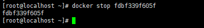

---

## 重启 WEB 应用容器

已经停止的容器，可以使用命令 `docker start` [ID 或者名字] 来启动。

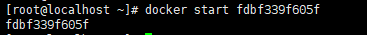

`docker ps -l` 查询最后一次创建的容器

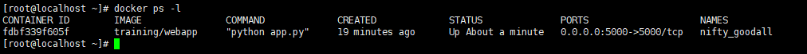

正在运行的容器,可以使用 `docker restart` [ID 或者名字] 命令来重启

---

## 移除 WEB 应用容器

可以使用 `docker rm` [ID 或者名字] 命令来删除不需要的容器

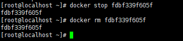

删除容器时,容器必须时停止状态,否则会报如下错误

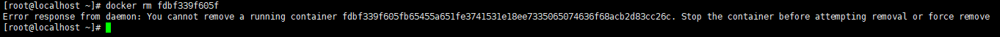
