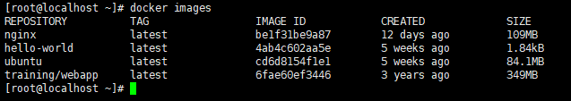

# Docker 镜像使用

当运行容器时，使用的镜像如果在本地中不存在，docker 就会自动从 docker 镜像仓库中下载，默认是从 Docker Hub 公共镜像源下载。

- 管理和使用本地 Docker 主机镜像
- 创建镜像

---

## 列出镜像列表

可以使用 `docker images` 来列出本地主机上的镜像.



各个选项说明:

- REPIOSITORY : 表示镜像的仓库源
- TAG: 镜像的标签
- IMAGE ID: 镜像ID
- CREATED: 镜像创建时间
- SIZE: 镜像大小

同一个仓库源可以有多个 TAG , 代表这个仓库源的不同版本,如 ubuntu 仓库源里, 有 15.10 , 14.04 等多个不同的版本,使用 REPOSITORY:TAG 来定义不同的镜像.
所以,如果要使用版本为15.10的 ubuntu 系统镜像来运行容器时,命令如下:

```bash
docker run -t -i ubuntu:15.10 /bin/bash
```

如果要使用版本为 14.04 的 ubuntu 系统镜像来运行容器时,命令如下:

```bash
docker run -t -i ubuntu:14.04 /bin/bash
```

如果不知道一个镜像的版本标签,例如只使用 ubuntu ,docker 将默认使用 ubuntu:latest 镜像.

---

## 获取一个新的镜像

当在本地主机上使用一个不存在的镜像时 Docker 就会自动下载这个镜像,如果想预先下载这个镜像,可以使用 `docker pull` 命令来下载它.


下载完成后,就可以直接使用这个镜像运行容器.

---

## 查找镜像

可以从 Docker Hub 网站来搜索镜像, Docker Hub 网址为: <https://hub.docker.com/> 也可以使用 `docker search` 命令来搜索镜像.比如需要一个 httpd 的镜像来作为web服务,可以通过 `docker search` 命令搜索 httpd 来寻找合适的镜像.

```bash
docker search httpd
```


说明:

- NAME : 镜像仓库的名称
- DESCRIPTION : 镜像的描述
- OFFICIAL : 是否 docker 官方发布

---

## 拖取镜像

使用上图中的 httpd 官方版本的镜像,使用命令 `docker pull` 来下载镜像.

```bash
docker pull httpd
```

下载完成后,就可以直接使用这个镜像了.

```bash
docker run httpd
```

---

## 创建镜像

当从 docker 镜像仓库中下载的镜像不能满足需求时,可以通过以下两种方式对镜像进行更改.

- 从已经创建的容器中更新镜像,并且提交这个镜像.
- 使用 Dockerfile 指令来创建一个新的镜像.

---

## 更新镜像

更新镜像之前,需要使用镜像来创建一个容器.

```bash
docker run -t -i ubuntu /bin/bash
```

在运行的容器内使用 `apt-get update` 命令进行更新.
在完成操作之后,输入 `exit` 命令来退出这个容器.
此时ID为245c3476f636的容器,是按照需求更改的容器,可以使用命令 `docker commit` 来提交容器副本.

```bash
docker commit -m="has update" -a="shisen" 245c3476f636 sen/ubuntu:v2
```


参数说明:

- -m : 提交的描述信息
- -a : 指定镜像的作者
- 245c3476f636 : 容器ID
- sen/ubuntu:v2 : 指定要创建的目标镜像名

可以使用 `docker images` 命令来查看新镜像 sen/ubuntu:v2


使用新镜像sen/ubuntu 来启动一个容器

```bash
docker run -t -i sen/ubuntu:v2 /bin/bash
```

---

## 构建镜像

使用命令 `docker build` ， 从零开始来创建一个新的镜像。为此，需要创建一个 Dockerfile 文件，其中包含一组指令来告诉 Docker 如何构建镜像。

```bash
cat Dockerfile
FROM    centos:6.7
MAINTAINER      Fisher "fisher@sudops.com"

RUN     /bin/echo 'root:123456' |chpasswd
RUN     useradd runoob
RUN     /bin/echo 'runoob:123456' |chpasswd
RUN     /bin/echo -e "LANG=\"en_US.UTF-8\"" >/etc/default/local
EXPOSE  22
EXPOSE  80
CMD     /usr/sbin/sshd -D
```

每一个指令都会在镜像上创建一个新的层，每一个指令的前缀都必须是大写的。

第一条FROM，指定使用哪个镜像源

RUN 指令告诉docker 在镜像内执行命令，安装了什么。。。

然后，使用 Dockerfile 文件，通过 `docker build` 命令来构建一个镜像。


参数说明:

- -t : 指定要创建的目标镜像名
- . : Dockerfile 文件所在的目录.可以指定Dockerfile的绝对路径

使用 `docker images` 查看创建的镜像,已经存在列表中.镜像 ID 为: 6eb1b5c84ed7


可以使用新的镜像来创建容器

```bash
docker run -t -i shisen/centos:6.7 /bin/bash
```


从上面可以看到.新的镜像已经包含我们创建的用户 shisen

---

## 设置镜像标签

可以使用 `docker tag` 命令,为镜像添加一个新的标签

```bash
docker tag 6eb1b5c84ed7 shisen/centos:dev
```

