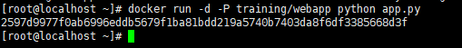
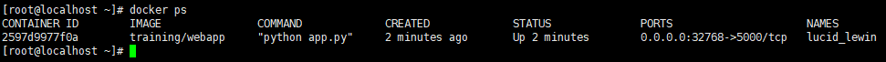
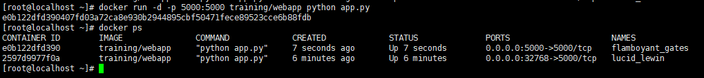
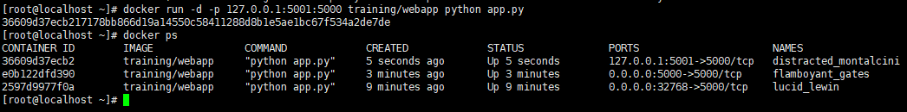
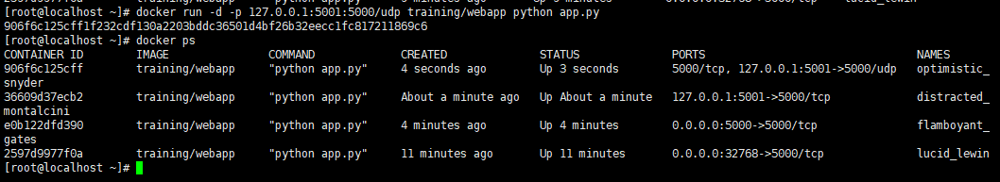
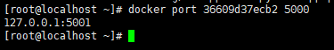
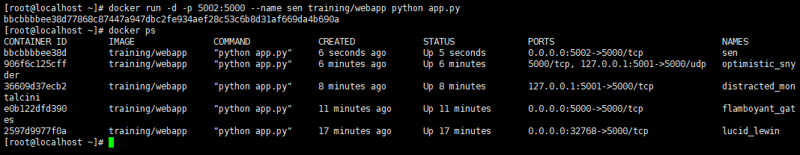

# Docker 容器连接

实现通过端口连接到一个 docker 容器.

---

## 网络端口映射

创建一个 python 应用的容器

```bash
docker run -d -P training/webapp python app.py
```



使用 -P 参数创建一个容器，使用 `docker ps` 来看到端口 5000 绑定主机端口 32768



我们也可以使用 `-p` 标识来指定容器端口绑定到主机端口

```bash
docker run -d -p 5000:5000 training/webapp python app.py
```



两种方式的区别是:

- -P : 是容器内部端口随机映射到主机的端口
- -p : 是容器内部端口绑定到指定的主机端口

另外,也可以指定容器绑定的网络地址,比如绑定 127.0.0.1

```bash
docker run -d -p 127.0.0.1:5001:5000 training/webapp python app.py
```



这样就可以通过访问 127.0.0.1:5001 来访问容器的 5000 端口。

上面的例子中，默认都是绑定 tcp 端口，如果要绑定 UDP 端口，可以在端口后面加上 /udp。

```bash
docker run -d -p 127.0.0.1:5001:5000/udp training/webapp python app.py
```



`docker port` 命令可以快捷地查看端口的绑定情况

```bash
docker port 36609d37ecb2 5000
```



---

## Docker 容器连接

端口映射并不是唯一把 docker 连接到另一个容器的方法。

docker 有一个连接系统允许将多个容器连接在一起，共享连接信息。

docker 连接会创建一个父子关系，其中父容器可以看到子容器的信息。

---

## 容器命名

当创建一个容器的时候，docker 会自动对它进行命名。另外，也可以使用 `--name` 标识来命名容器，例如：

```bash
docker run -d -p 5002:5000 --name sen training/webapp python app.py
```


